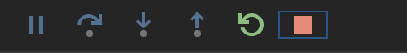

# Developing with Cloud Code

# Objectives

In this lab you will:

-  Explore Cloud Code Plugins
-  Deploy to Kubernetes cluster
-  Stream kubernetes Logs
-  Utilize hot reloading of changes
-  Debug live Kubernetes apps

# Preparing your workspace

## Clone the app

To clone the repository and open it in your development environment:

1. Open Cloud Shell editor by visiting the following url 

```
https://ide.cloud.google.com
```

1. In the terminal window clone the application source with the following command: 

```
git clone https://github.com/viglesiasce/sample-app.git -b golden-path 
```

1. Change into the directory and set the IDE workspace to the repo root

```
cd sample-app && cloudshell workspace .
```

## Start Minikube

In this section, you build, test, deploy, and access your application using a local version of kubernetes called Minikube.

1. In the terminal, start minikube by running:

```
minikube start
```

> Minikube sets up a local Kubernetes cluster in your Cloud Shell, this setup will take a few minutes. While it is starting, take a moment to review the various interfaces provided by Cloud Code in the next step. 

# Exploring Cloud Code Plugin

Cloud Code provides IDE support for the full development cycle of Kubernetes and Cloud Run applications, from creating an application from an existing template to monitoring your deployed app's resources. You'll be using different commands and views provided by Cloud Code. In this step you will get acquainted with the basic interfaces. 

1. Review the various explorer views from the activity bar

   Multiple user interface panels are accessible from the Activity bar. To briefly get acquainted with the various view click on the icons for each view

   API Explorer: 

      -  Click the Cloud Code - Cloud APIs icon Cloud Code from the Activity bar. Additional details for working in this view are available in the [documentation](https://cloud.google.com/code/docs/vscode/client-libraries).


      

   Secret Manager  Explorer: 

      -  Click on the Secret Manager view  in the Activity bar. Additional details for for working in this view are available in the [documentation](https://cloud.google.com/code/docs/vscode/secret-manager) 

      

   Cloud Run Explorer: 

      -  Navigate to the Cloud Run Explorer using the Cloud Run icon in the Activity bar on the left . Additional details for for working in this view are available in the [documentation](https://cloud.google.com/code/docs/vscode/cloud-run-overview) 

      

   Kubernetes explorer: 

      -  Navigate to the Kubernetes Explorer using the icon in the Activity bar on the left . Additional details for for working in this view are available in the [documentation](https://cloud.google.com/code/docs/vscode/k8s-overview) 

      

2. Review common commands available from the status bar

   Frequently used commands can be accessed quickly through the indicator in the status bar.

   -  Locate the Cloud Code extension indicator in the status bar and click on it.
       
   -  Review the various commands available to run and debug on CloudRun and Kubernetes
   -  Click on Open Welcome Page for additional details and sample activities

3. Review Commands available in the command pallet

   Additional commands are available from the command pallet. Review the list of commands you can access. 

   -  Open the Command Palette (press Ctrl/Cmd+Shift+P) and then type Cloud Code to filter the available commands. 
   -  Use your arrow keys to cycle through the list of commands. 

# Deploying to Kubernetes cluster

In this section, you build, test, deploy, and access your application. 

1. In the pane at the bottom of Cloud Shell Editor, select Cloud Code     

2. In the panel that appears at the top, select Run on Kubernetes. If prompted, select Yes to use the minikube Kubernetes context.

This command starts a build of the source code and then runs the tests. The build and tests will take a few minutes to run. These tests include unit tests and a validation step that checks the rules that are set for the deployment environment. This validation step is already configured, and it ensures that you get warning of deployment issues even while you're still working in your development environment.

3. Select the Output tab in the lower pane  to view progress and notifications
   
4. Select "Kubernetes: Run/Debug - Detailed" in the channel drop down to the right to view additional details and logs streaming live from the containers


When the build and tests are done, the Output tab says: `Resource deployment/gceme-backend-dev status completed successfully`, and two URLs are listed.

5. In the Cloud Code terminal, hover over the first URL in the output (http://localhost:8080), and then in the tool tip that appears select Open Web Preview.

The local version of the application opens in your browser. This version of the app is running in minikube's Kubernetes cluster.

6. In your browser, refresh the page. The number next to Counter increases, showing that the app is responding to your refresh.

In your browser, keep this page open so that you can view the application as you make any changes in your local environment.

# Utilize hot reloading of changes

In this section, you make a change to the application, and view the change as the app runs in the local Kubernetes cluster. In the output tab for the Kubernetes: Run/Debug channel, in addition to the application urls, the output also says `Watching for changes.` This means that watch mode is enabled. While Cloud Code is in watch mode, Cloud Code will detect any saved changes in your repo and will automatically rebuild and redeploy the app with the latest changes.

1. In Cloud Shell Editor, go to the main.go file.
2. In this main.go file, in line 23, change the color from green to blue.
3. Save the file.

Cloud Code detects that the change to the app is saved, and it redeploys the change automatically. The Output tab shows Update initiated. This redeployment will take a few minutes to run.

This automatic rebuild is similar to hot code reloading, which is a feature available for some application types and frameworks. 

4. When the build is done, go to your browser where you have the app open and refresh the page.

When you refresh, the color at the top of the table changes from blue to green.

This setup gives you this automatic reloading for any architecture, with any components. When using Cloud Code and minikube, anything that is running in Kubernetes has this hot code reloading functionality.

# Debugging live Kubernetes apps

You have run the application, made a change, and viewed the running app. In this section, you debug the application to be confident that it's ready to commit back into the main repo.

For this debug example, we'll focus on the section of the code for the page counter.

1. In Cloud Shell Editor, open the file main.go
2. Set a breakpoint in the application by clicking to the left  number of line 82 (if err != nil {)
3. In the blue pane at the bottom of Cloud Shell Editor, select Cloud Code    
4. In the panel that appears at the top, select Debug on Kubernetes.

Cloud Code runs and attaches debuggers so that you'll be able to access the in-memory state of the application, not just the user-facing behavior of the application.

5. At the end of the deploy process a prompt will appear at the top of your window asking to confirm the directory in the container where the application is deployed. 

   Verify the value is set to /go/src/app and hit enter to accept the value
6. Wait for the debugger to finish deploying. You'll know it's complete when the status bar turns orange and the output reports `"Attached debugger to container "sample-app-dev-..." successfully`."
7. In the Cloud Code terminal, hover over the first URL in the output (http://localhost:8081), and then in the tool tip that appears select Open Web Preview. The page won't finish loading which is expected.
8. Switch back to the IDE where the debugger now appears. Code comes up in the tab, and you'll see the call stack, what variables are available at that part of the code. You can expand the Variables - Local to see here the current counter variable value. 
9. To allow the page to continue to load, select the "Continue" icon in the debugging window    
10. When you're finished debugging click the stop button to terminate each of the running threads.    